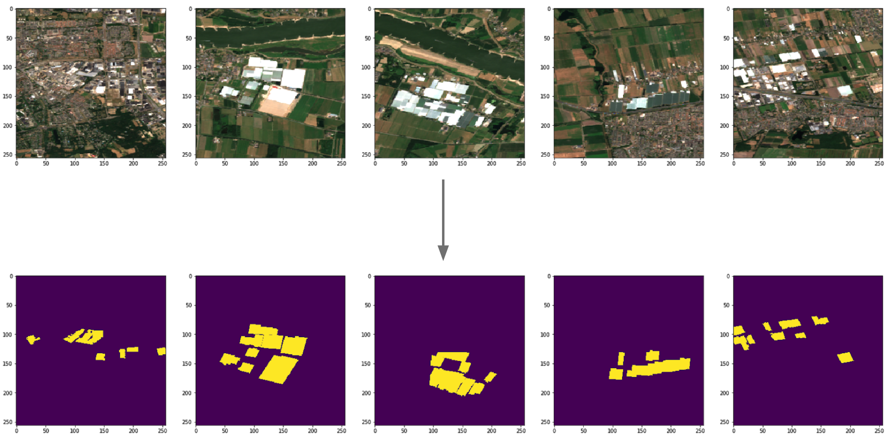
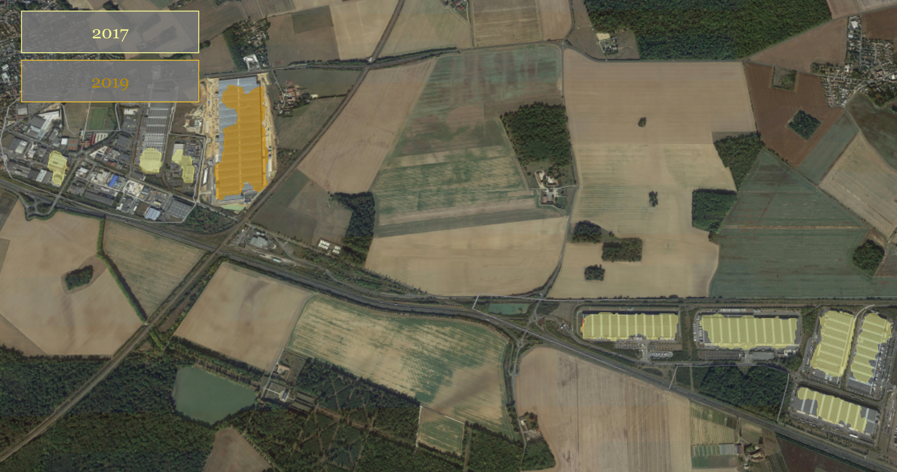
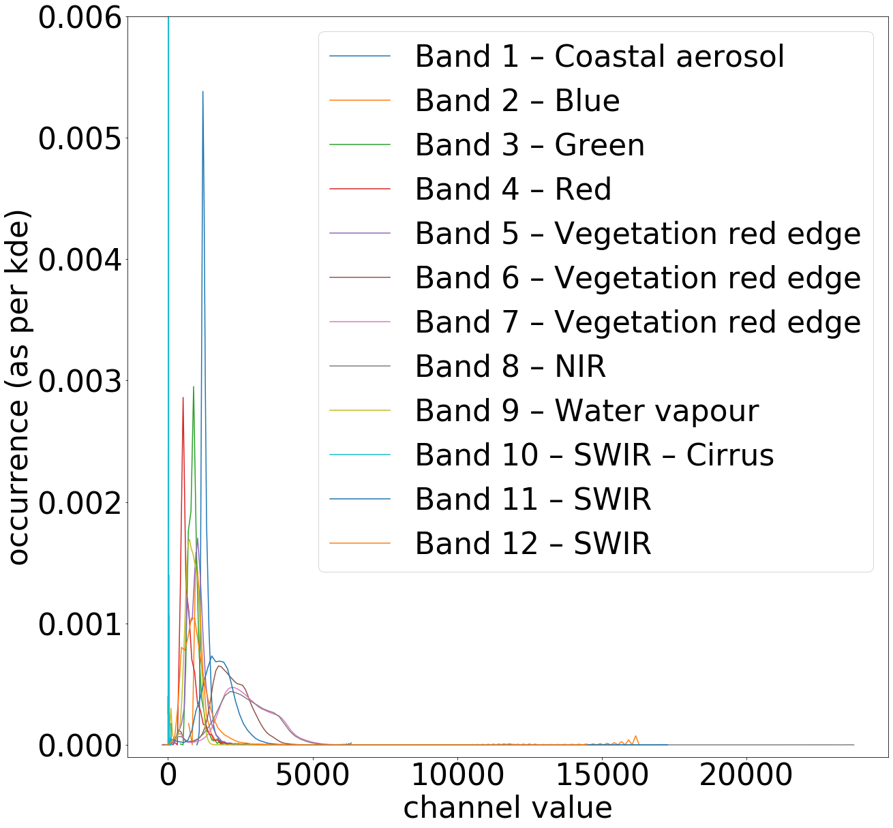

# Satelite image segmentation

Detecting warehouses and distribution centres in satelite images using U-Net deep learning.

## Participants

 * dr. Michiel Daams, principal investigator, University of Groningen, Faculty of Spatial Sciences
 * MSc Herbert Teun Kruitbosch, data scientist, University of Groningen, Data science team
 * MSc Leslie Zwerwer, data scientist, University of Groningen, Data science team
 * MSc Nicoletta Giudice, data scientist, University of Groningen, Data science team

(The data science team is a group of 10 data scientists and alike that assist researchers from all faculties with data science and scientific programming, as part of the universities Center of Information Technology)

## Project description

**Goal** We wish to locate box-like warehouses and distribution centres in Sentinel 2B satelite images. These images have pixels of approximately 10 x 10 meters in 12 spectral bands. We've trained a [U-NET](https://lmb.informatik.uni-freiburg.de/people/ronneber/u-net/) architecture on all these bands to predict specific building types.

**Data** Beside the sentinel images, we've used two sources for labels, or ground thruths, of where warehouses and distribution centres are located.

 * Basisregistratie Adressen en Gebouwen, an official and complete registration of Dutch buildings, and
 * OpenstreetMap, a crowd sourced data set of buildings.

This figure shows some examples data examples.

<table>
  <tr>	
    <td>
    
  </tr>
  <tr>
    <td>Figure 1. Example data</td>
  </tr>
</table>
 
**Motivation** Proper detection allows monitoring natural landscapes to track down environmental issues caused by buildings and their related activities. In paticular the boxification of landscapes, which is a recent issue due to increased demand for home-delivered goods.

**Results** Our current efforts lead to 75% recall and 64% precision when finding buildings inteded for warehousing. Besides imperfect training and moddeling, the gap to perfect classification is likely caused by Bayesian error and the imbalance between data. The former is illustrated by the buildings marked for detection in the figure below. 

<table>
  <tr>
    <td></td>
  </tr>
  <tr>
    <td>Figure 2. Bayesian error illustrated. The red labels are to be detected, however many buildings outside of these red regions look similar from above.</td>
  </tr>
</table>

The labels, or ground truth, is marked red. One can see that many other buildings look quite similar, as they have rectangular shapes and look while while surrounded by tarmac Data imbalence was tackled partially by weighing the cross-categorical entropy cost function heavier for pixels where buildings should be detected. This weight was tuned for best performance, and hence not directly based in the imbalance.

<table>
  <tr>
    <td></td>
    <td></td>
  </tr>
  <tr>
    <td colspan="2">Figure 3. Examples of detected 2019 buildings that weren't build yet in 2017.</td>
  </tr>
</table>

## Implementation

**Dependencies** Our code is based on `Python 3`, `Keras` and common libraries in this context like `matplotlib`. We also used `CGAL` to translate between coordinate systems and pixels, and `shapely` to apply polygon operations.

**Platform** We've worked on Google Colab with Google Drive. Since our University has quite some Google Drive space, we've stored all our data and intermediate results for different experiments there. This is unpractical for normal Google Drive users, as you'd need several 100GB of storage. You're likely better off using a Google Bucket or some other storage solution instead, if you wish to reuse our experiments.

**Preprocessing** The sentinel 2B images are roughly 10.000 by 10.000 pixels with 12 channels. As a preprocessing step, we've cut out regions with labeled buildings. Furthermore, our labels were provided as polygons, we've processed them to binary rasters suitable for U-NET. These cut-outs can easily overlap, hence we've split between training and testing data on satelite images, not on these cutouts, to avoid test-train contamination. Moreover, the twelve channels were scaled to a (-2, 2) range, for which their standard deviations and means were etimated. The values were scaled to have standard deviation 1 and mean 0, but outliers outside of 2 time sthe standard eviation were removed.

<table>
  <tr>
    <td></td>
  </tr>
  <tr>
    <td colspan="2">Figure 4. distribution of the 12 sentinel bands.</td>
  </tr>
</table>

 * [Notebook: Estimate distributions of channels](notebooks/preprocessing/Estimate%20mean%20and%20stddev.ipynb)
 * [Notebook: Rasterize polygons](notebooks/preprocessing/Create%20Training%20Data%20masks.ipynb)
 * [Notebook: Cutout relevant regions](notebooks/preprocessing/Estimate%20mean%20and%20stddev.ipynb)

**Machine Learning** For cross validation purposes, we've explicitely left out certain satelite images for either validation or testing. These were originally selected using `train_test_split`, but later fixed to allow for better reproducibility. This could not be done with a seed, for example when the order of the samples in our dataset would change due to different preprocessing.

 * [Notebook: Machine learning, training and validations](notebooks/machine-learning/Train%20U-NET.ipynb)

